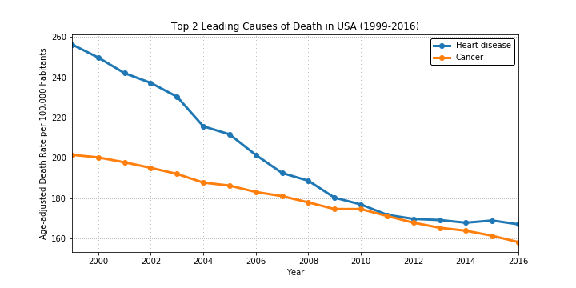

# causes_of_death_USA

## Goal:
Identify the main causes of death in the United States

## Resources used:
* Data from data.gov
* Python / Jupiter
	* NumPy
	* Pandas
	* Matplotlib
	* GMaps
	* scipy.stats
* MS Excel

## Output:
* There is not differences bewteen Northern and Southern states.

 
* The comparison was made using a parameter adjusted-death rate

* The main 2 causes of death are Heart disease and Cancer mainly in Eastern states

	* Heart disease map

 

	* Cancer map
	

